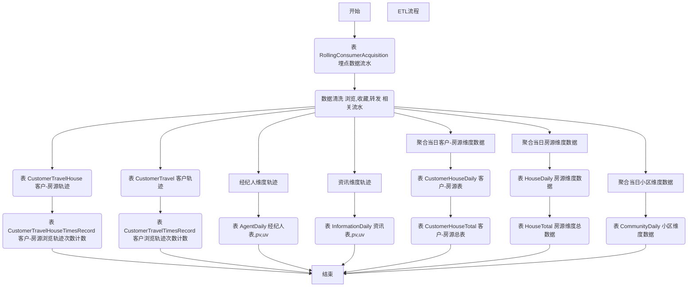

# 事件追踪 EventTracking

针对用户在产品中特定行为事件以及有关的一切信息进行捕获，处理和发送的相关技术及其实施过程。

### 包结构定义

项目，包目录主要分为四个模块
- interfaces 展现层
- application 应用层
- domain 领域服务层
- infrastructure 基础构建层

调用流程
``` 
interfaces -> application -> domain -> infrastructure
                   │                          ↑
                   └──────────────────────────┘
                  
```

1. interfaces 展现层

facade：存放控制器

dto：存放请求参数对象

assembler：存放调用应用层对象

dto和assembler的区别，举例，
系统中有一个枚举对象，仓库类型（typeId, typeName，typeLocation）
前端参数传了一个下拉列表参数0，表示仓库类型为0的枚举，在这个请求过程中我们可能会用到 typeName，也可能会用到 typeLocation

2. application 应用层

service：应用服务

event：服务监听

3. domain 领域服务层

这一层根据服务类型划分，不同的领域分为不同的子包，领域下再划分具体的领域服务

model.aggregates：聚合对象，即领域服务对象

model.vo：展现模型，按需

repository：持久化定义

service：应用层服务的实现在这里

service.engine：领域服务具体实现

service.logic：领域服务公共逻辑定义，按需

4. infrastructure 基础构建层

common：工具类

converter：转换器，实体-领域对象转换

dao.mongo：数据持久层，原概念中为mysql，这里实现为mongo

po：持久对象，实体

repository：仓库实现

#### 实体基础字段设计

| 字段         | 名称       | 类型  | 备注          |
| -------------- | ------------ | ------- | --------------- |
| id             | 默认主键 | Long|String(ObjectId)    |                 |
| createTime     | 创建时间 | Date    |                 |
| updateTime     | 修改时间 | Date    |                 |
| updateUserId   | 修改者    | Integer |                 |
| updateUserName | 修改者名称 | String  |                 |
| mark           | 逻辑删除标记 | Integer | 0-未标记;1-标记 |

#### 修改记录表字段设计

comm_update_remark

| 字段         | 名称       | 类型  | 备注          |
| -------------- | ------------ | ------- | --------------- |
| id             | 默认主键 | Long    |                 |
| content        | 修改内容 | String  |                 |
| createTime     | 创建时间 | Date    |                 |
| updateTime     | 修改时间 | Date    |                 |
| updateUserId   | 修改者    | Integer |                 |
| updateUserName | 修改者名称 | String  |                 |

#### 接口参数校验支持

- 请求头 保留关键字  sourceSystem 源系统
- 请求头 保留关键字  viaTimestamp 时间 格式 yyyy-MM-dd HH:mm:ss.SSS
- 请求头 保留关键字  signWrinkles 签名

接口签名校验规则
- 约定1，请求方式为`POST`
- 约定2，请求消息类型为`JSON`，即`Content-Type = application/json`
- 约定3，请求参数放入`RequestBody`中
- 约定4，接口参数对象序列化后的JSON字符串需要压缩
- 约定5，接口参数对象序列化过程中根据参数键的自然顺序进行排序
- 约定6，接口参数对象字段存在空参，则该空参参数字段不传，切勿传递空字符串`""`，或者空白内容`" "`
- 约定7，默认签名校验规则为`HmacSha256`

签名加密原文根据`源系统、时间、参数序列化结果`组合而成，三个字段以英文逗号`,`拼接，例证如下
```
var request = require('request');

var headers = {
    'accept': '*/*',
    'signWrinkles': '37618574fe910ae0a039195d638d4ae2818bbcb38e371b291ec1d9cccef3aa60',
    'sourceSystem': 'as',
    'viaTimestamp': '2020-07-01 12:12:12.12',
    'Content-Type': 'application/json'
};

var dataString = '{ "brand": "Huawei", "city": "江苏", "content": "{\\"house\\":22,\\"agent\\":23}", "elementId": "test.element", "endTime": "2020-09-14 12:13:14.000", "model": "note10", "mpAppId": "mshop", "appVersion": "1.0.0", "opTime": "2020-09-14 12:13:14.000", "openId": "5f222e-f35843-1f2c18-5f1717", "pageId": "test.Page", "pixelRatio": 10, "platform": "android", "screenHeight": 1000, "screenWidth": 300, "sdkVersion": "ojdk8", "startTime": "2020-09-14 11:12:13.000", "statusBarHeight": 100, "system": "sdk8", "uniqueId": 990011, "windowHeight": 400, "windowWidth": 300, "wxVersion": 10.01}';

var options = {
    url: 'http://192.168.10.107:8080/eventtracking/api/web/acquisition',
    method: 'POST',
    headers: headers,
    body: dataString
};

function callback(error, response, body) {
    if (!error && response.statusCode == 200) {
        console.log(body);
    }
}

request(options, callback);
```

- 源系统 `as`
- 时间 `2020-07-01 12:12:12.12`
- 参数序列化结果 `{"brand":"Huawei","city":"江苏","content":"{\"house\":22,\"agent\":23}","elementId":"test.element","endTime":"2020-09-14 12:13:14.000","model":"note10","mpAppId":"mshop","appVersion":"1.0.0","opTime":"2020-09-14 12:13:14.000","openId":"5f222e-f35843-1f2c18-5f1717","pageId":"test.Page","pixelRatio":"10","platform":"android","screenHeight":"1000","screenWidth":"300","sdkVersion":"ojdk8","startTime":"2020-09-14 11:12:13.000","statusBarHeight":"100","system":"sdk8","uniqueId":"990011","windowHeight":"400","windowWidth":"300","wxVersion":"10.01"}`

加密原文为 
```
as,2020-07-01 12:12:12.12,{"brand":"Huawei","city":"江苏","content":"{\"house\":22,\"agent\":23}","elementId":"test.element","endTime":"2020-09-14 12:13:14.000","model":"note10","mpAppId":"mshop","appVersion":"1.0.0","opTime":"2020-09-14 12:13:14.000","openId":"5f222e-f35843-1f2c18-5f1717","pageId":"test.Page","pixelRatio":"10","platform":"android","screenHeight":"1000","screenWidth":"300","sdkVersion":"ojdk8","startTime":"2020-09-14 11:12:13.000","statusBarHeight":"100","system":"sdk8","uniqueId":"990011","windowHeight":"400","windowWidth":"300","wxVersion":"10.01"}
```
x HmacSha256

加密结果为
```
37618574fe910ae0a039195d638d4ae2818bbcb38e371b291ec1d9cccef3aa60
```

即设置请求头`signWrinkles` 为 `37618574fe910ae0a039195d638d4ae2818bbcb38e371b291ec1d9cccef3aa60`

#### 日志链路记录

工具类 - 方法

CurrentRequestHolder#getSerialNumber

获取当前请求唯一ID，用于日志追踪

### 埋点业务实体设计

#### 1.埋点配置

| #    | 字段                | 类型   | 释义                                                         |
| ---- | ------------------- | ------ | ------------------------------------------------------------ |
| 1    | id                  | Long   | ID                                                           |
| 2    | pageName            | String | 页面名称                                                     |
| 3    | pageNameCn          | String | 页面中文名称                                                 |
| 4    | pageId              | String | 页面标识符                                                   |
| 5    | elementName         | String | 元素名称                                                     |
| 6    | elementNameCn       | String | 元素中文名称                                                 |
| 7    | elementId           | String | 元素标识符                                                   |
| 8    | moduleId            | String | 模块标识符                                                   |
| 9    | moduleLocator       | String | 模块定位符（新房=NWHUS、二手房=SHHUS、租房=RTHUS）           |
| 10   | eventType           | String | 事件类型（打开页面=VIEW\|页面点击=CLICK\|页面长按=HOLD） |
| 11   | actionType          | String | 操作类型，轨迹用（访问=VISIT\|收藏=COLLECT\|分享=REPOST\|空=EMPTY） |
| 12   | actionDefinition | String | 操作定义（访问经纪人=VIS_AGT\|访问房源=VIS_HUS\|查看资讯VIS_IFO\| 使用IM=USE_IM\|使用手机=USE_PHN\| 收藏经纪人COL_AGT\|收藏房源COL_HUS\|收藏资讯COL_IFO\| 转发资讯RPS_IFO\| 空=EMPTY） |
| 13   | endpoint            | String | 终端（B端=Business\|C端=Consumer）                                             |
| 14   | origin              | String | 来源（C端={小程序=MP\|网页=H5}）                             |
| 15   | generatedKey        | String | 统一标识（模块:页面:元素:事件类型）                          |

#### 2.模块配置

| #    | 字段          | 类型    | 释义         |
| ---- | ------------- | ------- | ------------ |
| 1    | id            | Long    | ID           |
| 1    | locator       | String  | 定位符       |
| 2    | name          | String  | 名称         |
| 3    | nameCn        | String  | 中文名称     |
| 4    | orderNumber        | Integer | 排序         |
| 5    | parentId      | Long    | 父节点ID     |
| 6    | parentLocator | Long    | 父节点定位符 |

### 统计业务实体设计

#### 1.上报埋点的数据信息表（all，暂定月表）

#### 表名 RollingConsumerAcquisition

@see com.apoem.mmxx.eventtracking.infrastructure.po.ConsumerAcquisitionOdsEntity

| \# | 字段              | 类型     | 释义                  |
|----|-----------------|--------|---------------------|
| 1  | city            | String | 用户所选城市              |
| 2  | opTime          | Date   | 操作时间                 |
| 3  | appId         | String | 小程序名称               |
| 4  | appVersion       | String | 小程序版本号              |
| 5  | openId          | String | 小程序用户 openid        |
| 6  | uniqueId        | String | 小程序用户 uniqueId      |
| 7  | brand           | String | 设备品牌                |
| 8  | model           | String | 设备型号                |
| 9  | pixelRatio      | String | 设备像素比               |
| 10 | screenWidth     | String | 屏幕宽度，单位px           |
| 11 | screenHeight    | String | 屏幕高度，单位px           |
| 12 | windowWidth     | String | 可使用窗口宽度，单位px        |
| 13 | windowHeight    | String | 可使用窗口高度，单位px        |
| 14 | statusBarHeight | String | 状态栏的高度，单位px         |
| 15 | wxVersion       | String | 微信版本号               |
| 16 | system          | String | 操作系统及版本             |
| 17 | platform        | String | 客户端平台               |
| 18 | sdkVersion      | String | 客户端基础库版本            |
| 19 | pageId          | String | 页面编号（字符串）           |
| 20 | elementId       | String | 元素编号（字符串）           |
| 21 | startTime       | Date   | 进入时间（时间戳）           |
| 22 | endTime         | Date   | 退出时间（时间戳）           |
| 23 | prevPage        | String | 上页                  |
| 24 | content         | Object | 自定义内容，防止数据变化        |

##### 自定义内容缺省

| \# | 字段                | 类型     | 释义                        |
|----|-------------------|--------|---------------------------|
| 1  | distributorId     | String | 分享者                       |
| 2  | agentId           | String | 经纪人                       |
| 3  | customerId        | String | 客户                        |
| 4  | contactedCustomerId | String | 被联系的客户     |
| 5  | informationId     | String | 资讯                        |
| 6  | houseId           | String | 房屋                        |
| 7  | houseName         | String | 房屋名称                      |
| 8  | housePrice       | String | 房价                        |
| 9  | houseArea         | String | 建筑面积                      |
| 10 | communityId   | String | 小区                        |
| 11 | communityName | String | 小区名称                      |
| 12 | houseLayout       | String | 户型                        |
| 13 | houseType         | String | 类型（二手房SHHS、新房NWHS、租房RTHS） |
| 14 | ......            | String | ...                       |

#### 2.用户轨迹（180）

#### 表名 CustomerTravel

@see com.apoem.mmxx.eventtracking.infrastructure.po.ws.CustomerTravelEntity

| \# | 字段                  | 类型                         | 释义 |
|----|---------------------|----------------------------|----|
| 1  | customerId          | String | 客户                         |
| 2  | opTime            | Date | 操作时间 yyyy-MM-dd HH:mm:ss.sss |
| 3  | actionType          | String | 浏览（房源、资讯、经纪人、...）、分享（房源、资讯、经纪人、...）、收藏（房源、资讯、经纪人、...） |
| 4  | origin              | String | 来源（小程序MP\|网页H5）            |
| 5  | content             | Object | 原文，客户端上报内容要具备自身能区分数据类型的能力  |
| 6  | viewTimes           | String | 浏览次数，仅浏览时计数             |
| 7  | duration            | String | 持续时间                       |

#### 3.用户轨迹次数总表

可以理解为客户最近一次浏览的记录

#### 表名 CustomerTravelTimesRecord

@see com.apoem.mmxx.eventtracking.infrastructure.po.ws.CustomerTravelTimesRecordEntity


| #    | 字段       | 类型    | 释义 |
| ---- | ---------- | ------- | ---- |
| 1    | customerId | String  | 客户 |
| 2    | actionType | String  | 浏览 |
| 3 | origin | String | 来源（小程序MP\|网页H5） |
| 4   | totalTimes | Integer | 次数 |
| 5    | lastOpTime | Date | 最后操作时间 |

#### 4.访客详情 = actionDefinition like house，客户-房源轨迹

#### 表名 CustomerTravelHouse

@see com.apoem.mmxx.eventtracking.infrastructure.po.ws.CustomerTravelHouseEntity

| #    | 字段          | 类型   | 释义                                     |
| ---- | ------------- | ------ | ---------------------------------------- |
| 1    | customerId    | String | 客户                                     |
| 2    | houseId       | String | 房源                                     |
| 3    | origin        | String | 来源（小程序MP\|网页H5）                 |
| 4    | opTime       | String | 操作时间yyyy-MM-dd HH:mm:ss.sss          |
| 5    | duration      | String | 持续时间                                 |
| 6    | actionType    | String | 浏览（房源）、分享（房源）、收藏（房源）、IM（房源）、电话（房源） |
| 7    | viewTimes     | String | 浏览次数，仅浏览时计数                   |
| 8    | distributorId | String | 分享者                                   |
| 3  | houseType      | String  | 新房、二手房、租房   |
| 5  | houseName      | String  | 房源名称        |
| 6  | housePrice     | String  | 房源价格        |
| 7  | houseArea      | String  | 房源面积        |
| 8  | houseLayout    | String  | 房源户型        |
| 9  | communityId     | String  | 小区          |
| 10 | communityName   | String  | 小区名称        |
| 16 | agentId        | Integer | 经纪人         |

#### 5.客户-用户轨迹次数总表

可以理解为客户最近一次浏览房源的记录

#### 表名 CustomerTravelHouseTimesRecord

@see com.apoem.mmxx.eventtracking.infrastructure.po.ws.CustomerTravelTimesRecordEntity


| #    | 字段        | 类型    | 释义         |
| ---- | ----------- | ------- | ------------ |
| 1    | customerId  | String  | 客户         |
| 2    | actionType  | String  | 浏览         |
| 3    | houseId     | String  | 房源         |
| 4    | totalTimes  | Integer | 次数         |
| 5    | lastOpTime | Date    | 最后操作时间 |


#### 6.客户-房源维度数据

#### 表名 CustomerHouseDaily

180天数据，满足 客源分析---最多浏览（180），
满足 房源数据---访客数据（7）

@see com.apoem.mmxx.eventtracking.infrastructure.po.ws.CustomerHouseDailyEntity

| \# | 字段             | 类型      | 释义          |
|----|----------------|---------|-------------|
| 1  | dateDay        | String  | 日期 yyyyMMdd |
| 2  | customerId     | String  | 客户          |
| 3  | houseType      | String  | 新房、二手房、租房   |
| 4  | houseId        | String  | 房源          |
| 5  | houseName      | String  | 房源名称        |
| 6  | housePrice    | String  | 房源价格        |
| 7  | houseArea      | String  | 房源面积        |
| 8  | houseLayout    | String  | 房源户型        |
| 9  | communityId     | String  | 小区          |
| 10 | communityName   | String  | 小区名称        |
| 11 | pageView       | Integer | 访问次数        |
| 12 | collected      | Integer | 收藏次数        |
| 13 | reposted       | Integer | 转发次数        |
| 14 | imContacted    | Integer | IM联系        |
| 15 | phoneContacted | Integer | 电话联系        |
| 16 | agentId        | Integer | 经纪人         |
| 17 | lastOpTime | Date | 最后操作时间 |

#### 7.客户-房源总表（记录总浏览、访客、收藏、转发，客户-房源唯一）

#### 表名 CustomerHouseTotal

@see com.apoem.mmxx.eventtracking.infrastructure.po.ws.CustomerHouseTotalEntity

| \#   | 字段           | 类型    | 释义               |
| ---- | -------------- | ------- | ------------------ |
| 1    | dateDay        | String  | 日期 yyyyMMdd      |
| 2    | customerId     | String  | 客户               |
| 3    | houseType      | String  | 新房、二手房、租房 |
| 4   | houseId        | String  | 房源               |
| 5  | houseName      | String  | 房源名称           |
| 6   | housePrice     | String  | 房源价格           |
| 7   | houseArea      | String  | 房源面积           |
| 8   | houseLayout    | String  | 房源户型           |
| 9  | communityId     | String  | 小区               |
| 10 | communityName   | String  | 小区名称           |
| 11 | pageView       | Integer | 访问次数           |
| 12  | collected      | Integer | 收藏次数           |
| 13  | reposted       | Integer | 转发次数           |
| 14  | imContacted    | Integer | IM联系             |
| 15  | phoneContacted | Integer | 电话联系           |
| 16 | agentId        | Integer | 经纪人             |
| 17 | lastOpTime | Date | 最后操作时间 |

#### 8.房源维度数据（7日数据）

#### 表名 HouseDaily

满足 效果分析---我的房源（1，7，30），
满足 客源分析---小区分析（28）,

@see com.apoem.mmxx.eventtracking.infrastructure.po.ws.HouseDailyEntity

| \#   | 字段           | 类型    | 释义               |
| ---- | -------------- | ------- | ------------------ |
| 1    | dateDay        | String  | 日期 yyyyMMdd      |
| 2    | houseType      | String  | 新房、二手房、租房 |
| 3    | houseId        | String  | 房源               |
| 4    | houseName      | String  | 房源名称           |
| 5    | housePrice     | String  | 房源价格           |
| 6    | houseArea      | String  | 房源面积           |
| 7    | houseLayout    | String  | 房源户型           |
| 8    | communityId     | String  | 小区               |
| 9    | communityName   | String  | 小区名称           |
| 10   | pageView       | Integer | 访问次数           |
| 11   | collected      | Integer | 收藏次数           |
| 12   | reposted       | Integer | 转发次数           |
| 13   | imContacted    | Integer | IM联系             |
| 14   | phoneContacted | Integer | 电话联系           |
| 15   | agentId        | Integer | 经纪人             |

#### 9.房源总表（记录总浏览、访客、收藏、转发，房源唯一）

#### 表名 HouseTotal

@see com.apoem.mmxx.eventtracking.infrastructure.po.ws.HouseTotalEntity

| \#   | 字段           | 类型    | 释义               |
| ---- | -------------- | ------- | ------------------ |
| 1    | dateDay        | String  | 日期 yyyyMMdd      |
| 2    | houseType      | String  | 新房、二手房、租房 |
| 3    | houseId        | String  | 房源               |
| 4    | houseName      | String  | 房源名称           |
| 5    | housePrice     | String  | 房源价格           |
| 6    | houseArea      | String  | 房源面积           |
| 7    | houseLayout    | String  | 房源户型           |
| 8    | communityId     | String  | 小区               |
| 9    | communityName   | String  | 小区名称           |
| 10   | pageView       | Integer | 访问次数           |
| 11   | collected      | Integer | 收藏次数           |
| 12   | reposted       | Integer | 转发次数           |
| 13   | imContacted    | Integer | IM联系             |
| 14   | phoneContacted | Integer | 电话联系           |
| 15   | agentId        | Integer | 经纪人             |

#### 10.小区维度数据（1，7，30）

#### 表名 CommunityDaily

@see com.apoem.mmxx.eventtracking.infrastructure.po.ws.CommunityDailyEntity

| \#   | 字段            | 类型              | 释义                         |
| ---- | --------------- | ----------------- | ---------------------------- |
| 1    | dateDay         | Integer           | 日期 yyyyMMdd                |
| 2    | agentId         | Integer           | 经纪人                       |
| 3    | communityId      | Integer           | 小区                         |
| 4    | communityName    | Integer           | 小区名称                     |
| 5    | dataType        | String            | 数据类型，昨日、七日，三十日 |
| 6    | all             | CommunityAnsEntity | 全部                         |
|      |                 | pageView          | 访问次数                     |
|      |                 | uniqueVisitor     | 访问用户数                   |
|      |                 | collected         | 收藏次数                     |
|      |                 | reposted          | 转发次数                     |
| 7    | newHouse        | CommunityAnsEntity | 新房                         |
|      |                 | pageView          | 访问次数                     |
|      |                 | uniqueVisitor     | 访问用户数                   |
|      |                 | collected         | 收藏次数                     |
|      |                 | reposted          | 转发次数                     |
| 8    | secondHandHouse | CommunityAnsEntity | 二手房                       |
|      |                 | pageView          | 访问次数                     |
|      |                 | uniqueVisitor     | 访问用户数                   |
|      |                 | collected         | 收藏次数                     |
|      |                 | reposted          | 转发次数                     |
| 9    | rentedHouse     | CommunityAnsEntity | 租房                         |
|      |                 | pageView          | 访问次数                     |
|      |                 | uniqueVisitor     | 访问用户数                   |
|      |                 | collected         | 收藏次数                     |
|      |                 | reposted          | 转发次数                     |


#### 11.经纪人统计，折线图连续点（all）

#### 表名 AgentDaily

@see com.apoem.mmxx.eventtracking.infrastructure.po.ws.AgentDailyEntity

| #    | 字段            | 类型                       | 释义                         |
| ---- | --------------- | -------------------------- | ---------------------------- |
| 1    | dateDay         | Integer                    | 日期 yyyyMMdd                |
| 2    | agentId         | String                     | 经纪人                       |
| 3    | initial         | Integer                    | 初始化数据标志               |
| 4    | all             | AgentAnsTypeItem           | 全部                         |
|      |                 | pageView                   | 访问次数                     |
|      |                 | uniqueVisitor              | 访问用户数                   |
|      |                 | totalPageView              | 当期总访问次数               |
|      |                 | totalUniqueVisitor         | 当期总访问用户数             |
|      |                 | pageViewRiseRate           | 当期访问次数上升率           |
|      |                 | uniqueVisitorRiseRate      | 当期访问用户数上升率         |
|      |                 | prevTotalPageView          | 上期总访问次数（连续）       |
|      |                 | prevTotalUniqueVisitor     | 上期总访问用户数（连续）     |
|      |                 | prevPageViewRiseRate       | 上期访问次数上升率           |
|      |                 | prevUniqueVisitorRiseRate  | 上期访问用户数上升率         |
|      |                 | customerAmount             | 新增客户数                   |
|      |                 | houseAmount                | 新增房源数                   |
|      |                 | totalCustomerAmount        | 当期总客户数                 |
|      |                 | totalHouseAmount           | 当期总房源数                 |
|      |                 | customerAmountRiseRate     | 当期新增客户数上升率         |
|      |                 | houseAmountRiseRate        | 当期新增房源数上升率         |
|      |                 | prevTotalCustomerAmount    | 上期总客户数（连续）         |
|      |                 | prevTotalHouseAmount       | 上期总房源数（连续）         |
|      |                 | prevCustomerAmountRiseRate | 上期新增客户数上升率（连续） |
|      |                 | prevHouseAmountRiseRate    | 上期新增房源数上升率（连续） |
| 5    | newHouse        | AgentAnsTypeItem           | 新房                         |
|      |                 | pageView                   | 访问次数                     |
|      |                 | uniqueVisitor              | 访问用户数                   |
|      |                 | totalPageView              | 当期总访问次数               |
|      |                 | totalUniqueVisitor         | 当期总访问用户数             |
|      |                 | pageViewRiseRate           | 当期访问次数上升率           |
|      |                 | uniqueVisitorRiseRate      | 当期访问用户数上升率         |
|      |                 | prevTotalPageView          | 上期总访问次数（连续）       |
|      |                 | prevTotalUniqueVisitor     | 上期总访问用户数（连续）     |
|      |                 | prevPageViewRiseRate       | 上期访问次数上升率           |
|      |                 | prevUniqueVisitorRiseRate  | 上期访问用户数上升率         |
|      |                 | customerAmount             | 新增客户数                   |
|      |                 | houseAmount                | 新增房源数                   |
|      |                 | totalCustomerAmount        | 当期总客户数                 |
|      |                 | totalHouseAmount           | 当期总房源数                 |
|      |                 | customerAmountRiseRate     | 当期新增客户数上升率         |
|      |                 | houseAmountRiseRate        | 当期新增房源数上升率         |
|      |                 | prevTotalCustomerAmount    | 上期总客户数（连续）         |
|      |                 | prevTotalHouseAmount       | 上期总房源数（连续）         |
|      |                 | prevCustomerAmountRiseRate | 上期新增客户数上升率（连续） |
|      |                 | prevHouseAmountRiseRate    | 上期新增房源数上升率（连续） |
| 6    | secondHandHouse | AgentAnsTypeItem           | 二手房                       |
|      |                 | pageView                   | 访问次数                     |
|      |                 | uniqueVisitor              | 访问用户数                   |
|      |                 | totalPageView              | 当期总访问次数               |
|      |                 | totalUniqueVisitor         | 当期总访问用户数             |
|      |                 | pageViewRiseRate           | 当期访问次数上升率           |
|      |                 | uniqueVisitorRiseRate      | 当期访问用户数上升率         |
|      |                 | prevTotalPageView          | 上期总访问次数（连续）       |
|      |                 | prevTotalUniqueVisitor     | 上期总访问用户数（连续）     |
|      |                 | prevPageViewRiseRate       | 上期访问次数上升率           |
|      |                 | prevUniqueVisitorRiseRate  | 上期访问用户数上升率         |
|      |                 | customerAmount             | 新增客户数                   |
|      |                 | houseAmount                | 新增房源数                   |
|      |                 | totalCustomerAmount        | 当期总客户数                 |
|      |                 | totalHouseAmount           | 当期总房源数                 |
|      |                 | customerAmountRiseRate     | 当期新增客户数上升率         |
|      |                 | houseAmountRiseRate        | 当期新增房源数上升率         |
|      |                 | prevTotalCustomerAmount    | 上期总客户数（连续）         |
|      |                 | prevTotalHouseAmount       | 上期总房源数（连续）         |
|      |                 | prevCustomerAmountRiseRate | 上期新增客户数上升率（连续） |
|      |                 | prevHouseAmountRiseRate    | 上期新增房源数上升率（连续） |
| 7    | rentedHouse     | AgentAnsTypeItem           | 租房                         |
|      |                 | pageView                   | 访问次数                     |
|      |                 | uniqueVisitor              | 访问用户数                   |
|      |                 | totalPageView              | 当期总访问次数               |
|      |                 | totalUniqueVisitor         | 当期总访问用户数             |
|      |                 | pageViewRiseRate           | 当期访问次数上升率           |
|      |                 | uniqueVisitorRiseRate      | 当期访问用户数上升率         |
|      |                 | prevTotalPageView          | 上期总访问次数（连续）       |
|      |                 | prevTotalUniqueVisitor     | 上期总访问用户数（连续）     |
|      |                 | prevPageViewRiseRate       | 上期访问次数上升率           |
|      |                 | prevUniqueVisitorRiseRate  | 上期访问用户数上升率         |
|      |                 | customerAmount             | 新增客户数                   |
|      |                 | houseAmount                | 新增房源数                   |
|      |                 | totalCustomerAmount        | 当期总客户数                 |
|      |                 | totalHouseAmount           | 当期总房源数                 |
|      |                 | customerAmountRiseRate     | 当期新增客户数上升率         |
|      |                 | houseAmountRiseRate        | 当期新增房源数上升率         |
|      |                 | prevTotalCustomerAmount    | 上期总客户数（连续）         |
|      |                 | prevTotalHouseAmount       | 上期总房源数（连续）         |
|      |                 | prevCustomerAmountRiseRate | 上期新增客户数上升率（连续） |
|      |                 | prevHouseAmountRiseRate    | 上期新增房源数上升率（连续） |

#### 12.资讯统计

#### 表名 InformationDaily

### 流程图 



---

目前系统定义 

动作定义（访问经纪人=VIS_AGT|访问房源=VIS_HUS|使用IM=USE_IM|使用手机=USE_PHN|收藏房源COL_HUS|转发房源COL_HUS|查看资讯VIS_IFO|缺省=EMPTY）

    EMPTY(缺省)
    VIS_AGT(访问经纪人)
    VIS_HUS(访问房源)
    VIS_IFO(查看资讯)
    USE_IM(使用IM)
    USE_PHN(使用手机)
    COL_AGT(收藏经纪人)
    COL_HUS(收藏房源)
    RPS_HUS(转发房源)
    COL_IFO(收藏资讯)
    RPS_IFO(转发咨询)

效果分析-经纪人-小区统计

维度，经纪人-城市-小区
维度，经纪人-城市-小区-房源类型

经纪人相关小区的访问量、访客数、收藏数、转发数

涉及动作定义 
统计 访问量、访客数 - VIS_HUS（访问房源）
统计 收藏数 - COL_HUS(收藏房源)
统计 转发数 - RPS_HUS(转发房源)

---

效果分析-经纪人-房源统计

维度，经纪人-城市-房源
维度，经纪人-城市-房源

经纪人相关房源的访问量、访客数、收藏数、转发数、IM联系数

涉及动作定义 
统计 访问量、访客数 - VIS_HUS（访问房源）
统计 收藏数 - COL_HUS(收藏房源)
统计 转发数 - RPS_HUS(转发房源)
统计 IM联系数 - USE_IM(使用IM)

---

运营后台-经纪人
维度，经纪人-城市

经纪人的访问量、访客数

涉及动作定义 
统计 访问量、访客数 - VIS_AGT（访问经纪人）

---

运营后台-房源
维度，房源-城市

房源的访问量、访客数

涉及动作定义 
统计 访问量、访客数 - VIS_HUS（访问房源）

---

运营后台-资讯
维度，资讯-城市

资讯的访问量、访客数

涉及动作定义 
统计 访问量、访客数 - VIS_IFO（访问资讯）

---

门店后台-门店
维度，门店-城市

门店的访问量、访客数、收藏数、收藏客数

涉及动作定义 
统计 访问量、访客数 - VIS_HUS（访问房源）、VIS_AGT（访问经纪人）
统计 收藏数、收藏客数 - COL_HUS（收藏房源）、COL_AGT（收藏经纪人）

---


上线备忘

初始化 et_module（1）、et_track_point（893） 表
初始化 tb_mongo_table_sequence


db.tb_mongo_table_sequence.update({"_id":"et_module"},{$set:{'sequence':1}})
db.tb_mongo_table_sequence.update({"_id":"et_track_point"},{$set:{'sequence':893}})

修改

业务接口  联系php张涛涛线上是否需要变更
POST /dcenter/common-conf HTTP/1.1
Host: 192.168.105.139
Content-Type: application/x-www-form-urlencoded
accToken=e4e57fa25385a19f392710c016d915db&timestamp=11

线上数据库名db_eventtracking

提供接口
8080端口划分收集和8081划分计算和9090划分监控


数据统计
每日可能会有少量数据跨天，运营确认可纳入第二天周期内处理，特殊情况下另行安排。

H5相关埋点没有open_id，导致结果pv有值，uv为0


mongo要专门为表创建用户

db.createUser({ user: "msAuth", pwd: "msAuth123", roles: [{ role: "dbOwner", db: "db_eventtracking" }] })

#  手动操作，上传新文件到此目录
/srv/newload

启动脚本位置
/srv

测试环境部署
sh ./srv/deploy_test_acq.sh
sh ./srv/deploy_test_ans.sh

线上环境部署
sh ./srv/deploy_prod_acq.sh
sh ./srv/deploy_prod_ans.sh
sh ./srv/deploy_prod_admin.sh


如果使用 Alibaba Cloud Upload 文件
执行脚本改写为

测试环境部署
sh ./../deploy_test_acq.sh
sh ./../deploy_test_ans.sh

线上环境部署
sh ./../deploy_prod_acq.sh
sh ./../deploy_prod_ans.sh
sh ./../deploy_prod_admin.sh


